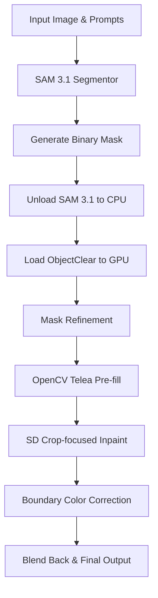

# 🚀 Object Removal - High-Quality AI Object Removal Platform

Đây là dự án xử lý hình ảnh xóa vật thể chất lượng cao (Quality-First Object Removal) được tối ưu hóa cho môi trường sản xuất (Production-ready). Dự án kết hợp mô hình phân đoạn hình ảnh tiên tiến **SAM 3.1** (Segment Anything Model) và mô hình khuếch tán inpainting **ObjectClear** để đem lại kết quả xóa vật thể tự nhiên và sắc nét nhất.

---

## 🏗️ Pipeline Kiến trúc & Luồng xử lý End-to-End

Dự án triển khai một pipeline tuần tự được tối ưu hóa GPU VRAM cực kỳ nghiêm ngặt nhằm tránh các lỗi tràn bộ nhớ (Out-Of-Memory - OOM) trên card đồ họa phổ thông:



### Chi tiết các bước trong Pipeline:
1.  **SAM 3.1 Segmentation (GPU)**: Tiếp nhận ảnh đầu vào cùng chỉ định của người dùng (tọa độ điểm click, bounding box vẽ tay, hình tròn bao quanh vật thể, hoặc câu lệnh văn bản prompt tiếng Việt/tiếng Anh) để sinh ra mặt nạ (mask) phân đoạn đối tượng chính xác.
2.  **GPU VRAM Release**: Giải phóng bộ nhớ card đồ họa bằng cách chuyển (unload) trọng số mô hình SAM 3.1 từ GPU sang CPU ngay sau khi thu được mask.
3.  **Mask Refinement**: Lấp các lỗ rỗng bên trong đối tượng, thực hiện phép giãn nở (dilation) để che phủ hoàn toàn rìa vật thể và bóng đổ, sau đó làm mịn rìa mask bằng bộ lọc Gaussian Blur.
4.  **OpenCV Telea Pre-fill**: Inpaint nhanh vùng đối tượng bằng thuật toán Telea của OpenCV để xóa bỏ thông tin màu sắc gốc, giúp mô hình Stable Diffusion không bị "ám" màu vật thể cũ khi sinh ảnh mới.
5.  **ObjectClear Inpainting (GPU)**: Đưa vùng ảnh cắt cục bộ quanh vật thể vào mô hình ObjectClear để phục dựng nền tự nhiên và đồng nhất với môi trường xung quanh.
6.  **Color Correction & Blending**: Tính toán độ sai lệch màu sắc ở dải biên ngoài mask của ảnh gốc và ảnh sinh, bù trừ sắc độ để tránh hiện tượng loang lổ, cuối cùng chèn nhiễu hạt nhẹ (subtle noise) và blend đè lại ảnh gốc.

---

## 📂 Cấu trúc thư mục Dự án

```text
auto-removal/
├── backend/                    # FastAPI Backend
│   ├── app/
│   │   ├── main.py             # Khởi chạy ứng dụng FastAPI & lifespan seeding
│   │   ├── pre_start.py        # Kiểm tra kết nối DB trước khi chạy app/test
│   │   ├── api/                # API Routers, Deps, và Image Utils dùng chung
│   │   ├── crud/               # Module tương tác DB cho User
│   │   ├── models/             # Định nghĩa thực thể Database
│   │   ├── schemas/            # Validate request/response API đầu vào/đầu ra
│   │   └── services/           # Module lõi AI: segmentation/ và inpainting/ (ObjectClear)
│   ├── scripts/                # Lệnh tiền khởi động (prestart.sh, test.sh,...)
│   └── tests/                  # Bộ unit test và integration test
│
├── frontend/                   # Frontend UI (Vite + React 19 + TypeScript)
├── compose.yml                 # Docker Compose cấu hình GPU phục vụ local dev
├── k8s/                        # File cấu hình Minikube Kubernetes (Deployment, Service)
├── scripts/                    # Các scripts tiện ích chạy ngoài máy host
└── samples/                    # Ảnh mẫu đầu vào phục vụ kiểm thử
```

---

## ⚡ Bắt đầu nhanh (Getting Started)

### Bước 1: Thiết lập cấu hình môi trường
Sao chép tệp cấu hình môi trường mẫu thành tệp cấu hình chính thức:
```bash
cp .env.example .env
```
*(Nếu cần, hãy chỉnh sửa khóa `HF_TOKEN` trong tệp `.env` để phân quyền tải mô hình từ HuggingFace).*

### Bước 2: Tải các Weights mô hình AI về máy host
Chạy script tự động tải mô hình SAM 3.1 từ HuggingFace:
```bash
.venv/bin/python scripts/download_models.py
```
*   Tệp checkpoint SAM 3.1 sẽ được tải về thư mục cache của máy host (`~/.cache/huggingface/hub/`).
*   Mô hình `jixin0101/ObjectClear` sẽ tự động tải khi gọi chạy inpainting lần đầu tiên.

---

## 🧪 Chạy thử nghiệm Pipeline End-to-End

### Phương án A: Chạy trực tiếp trên máy host (Có hỗ trợ CUDA)
Bạn có thể chạy thử nghiệm toàn bộ luồng pipeline từ đầu đến cuối mà không cần khởi động toàn bộ Docker Stack. 

Đảm bảo bạn đứng ở thư mục `backend/` khi chạy lệnh để Pydantic Settings đọc đúng tệp cấu hình `.env`:
```bash
cd backend
SAM31_CHECKPOINT_PATH=../models/sam3.1_multiplex.pt MODEL_CACHE_DIR=../models ../.venv/bin/python ../scripts/test_inpainting.py --image ../samples/coffee.jpg --point 400,300 --device cuda
```
*   **Kết quả đầu ra**: Tất cả các tệp debug từng bước (ảnh gốc, raw mask, refined mask, crop input, crop output, kết quả so sánh trước/sau) sẽ được lưu tại thư mục `backend/outputs/test_inpaint/`.

### Phương án B: Khởi chạy toàn bộ hệ thống bằng Docker Compose
Dành cho môi trường phát triển cục bộ đầy đủ cả giao diện người dùng (Frontend) lẫn cơ sở dữ liệu:
```bash
# Khởi động dịch vụ trong nền
docker compose up -d

# Xem log chạy của dịch vụ backend
docker compose logs -f backend
```
*   **Frontend**: `http://localhost:5173`
*   **Backend API Docs**: `http://localhost:5000/docs`

---

## ☸️ Triển khai Production với Kubernetes (Minikube)

Dự án cung cấp sẵn tệp kịch bản triển khai ứng dụng trên cụm Minikube cục bộ:

```bash
# Khởi động minikube (nếu chưa chạy)
minikube start

# Build các Docker images trực tiếp trong môi trường của minikube và deploy
bash scripts/minikube-build-images.sh
bash scripts/minikube-deploy.sh
```

Kiểm tra và quản lý tài nguyên trong namespace `object-removal-demo` bằng công cụ `k9s`:
```bash
k9s --context minikube -n object-removal-demo
```
Các cổng truy cập mặc định trên Minikube IP:
*   **Frontend UI**: `http://$(minikube ip):30073`
*   **Backend API**: `http://$(minikube ip):30080`

---

## 🛠️ Phát triển & Chạy Tests

### Backend Development
Để đồng bộ hóa môi trường Python cục bộ và chạy máy chủ backend dev:
```bash
cd backend
uv sync
uv run uvicorn app.main:app --reload --port 8000
```

Chạy bộ kiểm thử tự động (Unit và Route Mock tests):
```bash
cd backend
POSTGRES_PORT=5432 uv run pytest
```

### Frontend Development
```bash
cd frontend
npm install
npm run dev
```

---

## 💡 Lưu ý khi vận hành GPU trên Docker
*   Yêu cầu cài đặt **NVIDIA Container Toolkit** trên máy host để docker container có quyền truy cập GPU.
*   Cấu hình GPU trong `compose.yml` sử dụng directive `deploy.resources.reservations.devices` với driver `gpus: all`.
